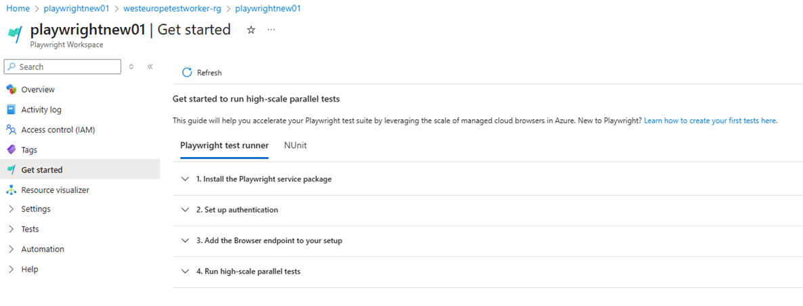

# Set up continuous end-to-end testing with Playwright Workspaces

This guide explains how to set up **Playwright Workspaces** for continuous end-to-end testing on the **TypeScript Playwright project** (`playwright-ts-poc`).  
---

##  Prerequisites

Before you begin, make sure you have:

- ✅ An **active Azure subscription**.  
  If you don’t have one, [create a free Azure account](https://azure.microsoft.com/free/).
- ✅ A **Playwright repository** with test cases.  

---

## Step 1: Create a Playwright Workspace
1. **Sign in** to the [Azure portal](https://portal.azure.com/).  
2. In the search bar, type **Playwright Workspaces** and **create a new workspace**.  
3. Once created, open the workspace and select the **Get Started** page.  
   
4. Go to **Step 3: Add Region Endpoint**, and **copy the Region Endpoint URL**.
5. In your GitHub repository:
   - Add the copied URL as a GitHub Actions secret with the name:

     ```
     PLAYWRIGHT_SERVICE_URL
     ```

6. Add a service configuration file named `playwright.service.config.ts` to your repo.  
   Use the sample file from the [official GitHub repo](https://github.com/Azure/playwright-workspaces/blob/main/samples/playwright-tests/playwright.service.config.ts).

7. Save and commit the file to your source control.

8. Update your `package.json` to include the Playwright Workspaces package:

   ```json
   "devDependencies": {
     "@azure/playwright": "latest"
   }
```

## Step 2: Setup Microsoft Entra ID Authentication
Playwright Workspaces uses Microsoft Entra ID for secure authentication.

1. In Azure portal, navigate to Entra ID and Create App Registration
    - Go to Azure Portal > Microsoft Entra ID > App Registrations.
    - Create a new app registration.

2. Grant Permissions
    - Ensure the app has necessary permissions (e.g., Azure Service Management or Playwright service-specific permissions).

3. Configure GitHub Actions for OIDC
OIDC (OpenID Connect) allows GitHub Actions to authenticate securely with Azure without storing credentials. Make sure you’ve followed the required setup:
    - Go to Azure Active Directory > App Registrations > Federated Credentials.
    - Create a new credential with: 
        * Subject Identifier: repo:<OWNER>/<REPO>:branch:<branch_name>
        * Audience: api://AzureADTokenExchange.

4. Add Secrets in GitHub Actions
In your GitHub repo, go to Settings → Secrets and variables → Actions → New repository secret, and add:
    - Add the following secrets:
       * AZURE_CLIENT_ID
       * AZURE_TENANT_ID
       * AZURE_SUBSCRIPTION_ID
       * PLAYWRIGHT_SERVICE_URL

5. Assign Contributor Role to App Registration
    - Go to your Playwright Workspace in Azure Portal.
    - Navigate to Access Control (IAM) 
    - Click Add-> Add Role Assignment.
    - Assign the Contributor role to your registered app.


## Next Steps
Once setup is complete:

Configure your GitHub Actions workflow to run Playwright tests automatically.
[Example CI workflow] (.github\workflows\msplaywright.yml)